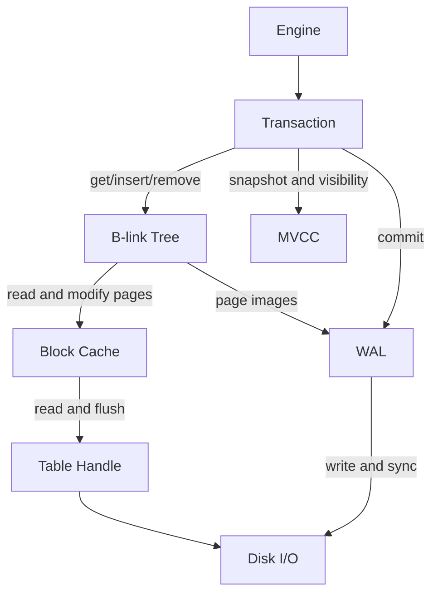

# LFDB

Lock-Free Key-Value Storage Engine implemented in Rust.

A persistent, ACID-compliant embedded key-value store built for high-concurrency workloads. It supports concurrent reads and writes from multiple threads simultaneously — with no writer lock and no reader starvation — through a combination of B-link tree indexing, MVCC snapshot isolation, and a lock-free WAL.

## Usage

### Open

The path passed to `EngineBuilder` is used as a dedicated data directory. The engine creates WAL segments and per-table data files inside it. Use a directory that is not shared with other applications.

```rust
use lfdb::EngineBuilder;

let engine = EngineBuilder::new("./data")
    .block_cache_memory_capacity(128 << 20) // 128MB
    .boot()?;
```

### Create Table

```rust
let mut tx = engine.new_tx()?;
tx.open_table("users")?;
tx.commit()?;
```

### Read & Write

```rust
let mut tx = engine.new_tx()?;
let users = tx.table("users")?;

users.insert(b"key1".to_vec(), b"value1".to_vec())?;

assert!(users.contains(b"key1")?);
let value = users.get(b"key1")?; // returns Option<VecRef> similar to a slice.

users.remove(b"key1")?;

tx.commit()?;
```

### Range scan

```rust
let tx = engine.new_tx()?;
let users = tx.table("users")?;

// Range scan [start, end)
let mut iter = users.range(b"key1"..b"key3")?;
while let Some((key, value)) = iter.try_next()? {
    // process
}

// Range reverse scan [start, end)
let mut iter = users.range_rev(b"key1"..b"key3")?;
while let Some((key, value)) = iter.try_next()? {
    // process
}

// Full scan
let mut iter = users.range::<[_]>(..)?;
while let Some((key, value)) = iter.try_next()? {
    // process
}
```

### Compact Table

```rust
let mut tx = engine.new_tx()?;
tx.compact_table("users")?;
tx.commit()?; 
// commit dispatches the compaction and returns immediately
// the compaction itself runs in the background
```

### Truncate Table

```rust
let mut tx = engine.new_tx()?;
tx.truncate_table("users")?;
tx.commit()?; 
```

### Drop Table

```rust
let mut tx = engine.new_tx()?;
tx.drop_table("users")?;
tx.commit()?;
```

### Multi-Table Transaction

```rust
let mut tx = engine.new_tx()?;
let users = tx.table("users")?;
let orders = tx.table("orders")?;

users.insert(user_id.clone(), user_data)?;
orders.insert(order_id, order_data)?;

tx.commit()?; // atomic across both tables
```

### Metrics

```rust
let m = engine.metrics();
println!("uptime: {}ms", m.uptime_ms);
println!("cache hit: {}", m.block_cache_hit);
println!("get p99: {}µs", m.operation_get_latency_micros_p99);
```


## Configuration

| Option | Description |
|--------|-------------|
| `wal_file_size` | Size limit of a single WAL segment file. When exceeded, a new segment is created. Larger segments improve write throughput by reducing rotation/checkpoint frequency, but extend recovery time on crash since more records must be replayed before the engine becomes available. |
| `wal_buffer_size` | Soft limit of WAL buffer size. |
| `io_thread_count` | Number of background IO worker threads shared across tables for write batching. Each table holds at most one worker at a time. |
| `checkpoint_flush_factor` | Determines the growth factor at which to flush the block cache at the checkpoint. In environments with frequent WAL segment replacement, such as write-heavy workloads, pressure increases exponentially at the set ratio. |
| `block_cache_memory_capacity` | Total memory allocated to the block cache. Since the engine uses Direct I/O and bypasses the OS page cache, a larger block cache is critical for performance. |
| `block_cache_shard_count` | Number of block cache shards. More shards reduce lock contention but shrink each shard's capacity, increasing eviction frequency. |
|`block_cache_buffer_size`| This specifies the size of the cache and buffers used for zero-copy reads and copy-on-write operations, cache evictions. We recommend setting the size to (number of threads expected to access simultaneously) × 4 MiB. |
| `gc_batch_size` | Number of keys to advance per gc tick. |
| `compaction_threshold` | Dead key ratio that triggers auto compaction. Each table's fragmentation ratio is evaluated every update and a compaction is dispatched once the ratio exceeds this threshold. Lower values trigger compaction more frequently; each triggered compaction can degrade read performance while it is running. Set to `1.0` to disable auto compaction entirely. |
| `compaction_min_size` | Minimum size requirements for auto compaction triggers. |
| `compaction_batch_size` | Number of keys to copy per compaction tick. |
| `transaction_timeout` | Maximum lifetime of a transaction before it is automatically aborted. |


## Architecture



For more details, see [architecture.md](docs/architecture.md).


### Characteristics

- **Embedded, single process**: the database is opened by one process at a time. `Engine` can be wrapped in an `Arc` and shared freely across threads within the same process.
- **Key ordering**: keys are compared as raw bytes in lexicographic order.

### Transaction Lifecycle and Isolation

LFDB provides **Snapshot Isolation**. Each transaction reads from a consistent snapshot taken at the moment it starts — concurrent writes by other transactions are invisible until they commit, and only to transactions that begin after the commit. The same rules apply uniformly to every operation, including DDL such as `open_table` and `drop_table`.

**Visibility rules:**
- A transaction always sees its own writes
- Only committed transactions' writes are visible to others
- A transaction started before a commit will never see that commit's writes — even if the commit completes before the transaction ends

**Write conflicts:**
A `WriteConflict` is returned whenever two concurrent transactions race on the same resource. It applies uniformly to every mutating operation:

- **Row writes** — two transactions inserting or removing the same key
- **Table creation** — two transactions calling `open_table` with the same name on a table that does not yet exist
- **Table drop** — two transactions calling `drop_table` on the same table

In every case the loser gets `WriteConflict` at the call site (not at commit). The application is responsible for retrying.

Optimistic locking is straightforward — read, compute, write, and retry on conflict:

```rust
loop {
    let mut tx = engine.new_tx()?;
    let table = tx.table("accounts")?;
    let current = table.get(&key)?;
    let next = compute_next(current);
    match table.insert(key.clone(), next) {
        Ok(_) => {},
        Err(Error::WriteConflict) => continue,
        Err(e) => return Err(e),
    }
    tx.commit()?;
    break;
}
```

**Auto-abort:**
A transaction automatically aborts on drop if `commit()` was not called. There is no need to explicitly call `abort()` on error paths.

**Timeout:**
A transaction that exceeds its configured timeout is automatically aborted. Any subsequent operation returns `TransactionClosed`.

### Crash Recovery

LFDB recovers automatically on restart — no manual intervention is required.

On startup, the engine replays the WAL and redoes all committed transactions since the last checkpoint. Uncommitted transactions (those that were in-flight at the time of the crash) are treated as aborted and their writes are invisible.

**Durability guarantee**: `commit()` returns only after the WAL record has been fsynced to disk. If `commit()` returned `Ok`, the transaction will survive a crash.

**Disk failures:** If `commit()` returns a `WALFailed` error while writing
or synchronizing the WAL, the commit outcome is unknown. Applications must not
retry the transaction under the assumption that it was aborted. LFDB makes the
engine unavailable and rejects further operations to preserve the last
recoverable WAL state. The application is responsible for resolving the
underlying storage failure and restarting the engine. After recovery, the
application must verify whether the transaction was committed before retrying
it.

### Logging

LFDB emits logs through the [`log`](https://crates.io/crates/log) crate facade. Refer to its documentation for backend setup and filter configuration.


## Benchmark

See [[benchmark.md]](docs/benchmark.md).


## Limitations

- **Key size**: maximum 256 bytes
- **Value size**: maximum 33,554,432 bytes (32 MiB)
- **Heavy removes**: heavy delete workloads warrant care. Disk space freed by removes is returned to the per-table free list and reused for new writes. When auto compaction is triggered, the table is rebuilt into a new file, and reads that happen during the compaction pay an extra cost because they are routed across both the old and the new file until the swap completes.


## License

Apache License 2.0 - See [LICENSE](LICENSE) for details.
